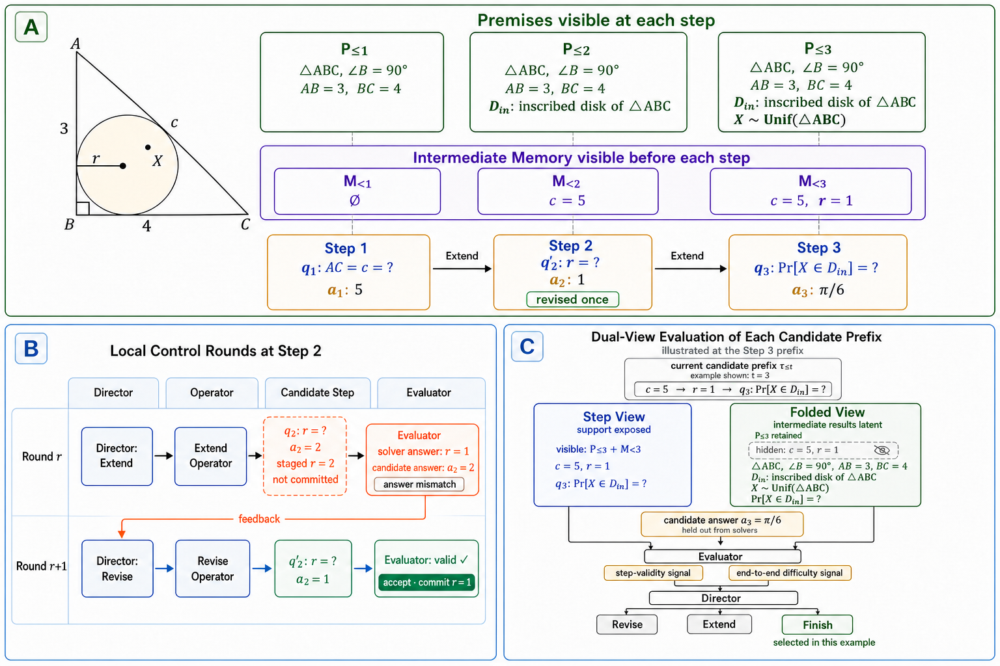

# AgenQA-PreRelease

**AgenQA research project preview: agentic data synthesis for scientific reasoning QA benchmark construction.**

[中文](./README.md) · [Paper Preview PDF](./paper-preview/agenqa_paper_preview.zh.pdf) · [Evaluation Results](./docs/experiments.md) · [Sample Questions](./docs/examples.pdf) · [Architecture](./docs/architecture.md) · [Prompt Files](./prompts/)

## 30-Second Snapshot

AgenQA studies how to synthesize challenging scientific reasoning QA data while keeping the generation process verifiable, repairable, and evaluable.


- **Core method**: grow a step-verifiable **Chain-of-KQA**, then apply **Path-Fold** to hide intermediate facts and create a harder solver-facing **Path View**.
- **Verification views**: project the same dependency chain into local **Edge Views** and global **Path Views**, separating correctness control from difficulty amplification.
- **System design**: organize init / extend / revise / finish through a **Director--Operator--Evaluator loop** over an explicit reasoning state.
- **Evaluation signal**: Path View questions reach **84.18%** aggregate accuracy across SOTA solvers and **51.77%** on a diagnostic subset; within the Qwen family, benchmark accuracy is positively correlated with model scale / expected capability (**48.00%** for 4B and **66.86%** for 32B). In an early downstream training snapshot, around **2K** AgenQA examples improve Qwen3-4B-Instruct from **59.62** to **61.98** on AIM24 while keeping GPQA-family scores essentially unchanged.

**Complementary worked example:** the constructed three-step example below shows how Premises and Intermediate Memory grow, how a mismatched candidate answer is revised locally, and how the same candidate prefix enters Step/Folded dual-view evaluation. It explains the mechanism rather than reporting an actual AgenQA run, gold case, or difficulty result.



## Recommended Reading

Start with the [AgenQA Paper Preview PDF](./paper-preview/agenqa_paper_preview.zh.pdf). It contains the most polished paper-style overview: title, abstract, Motivation and Core Idea, Contributions, AgenQA Framework, Experimental Showcase, Conclusion, and References.

| What to inspect | Entry |
| --- | --- |
| Paper-style project overview | [Paper Preview PDF](./paper-preview/agenqa_paper_preview.zh.pdf) |
| Core evaluation tables | [docs/experiments.md](./docs/experiments.md) |
| Three representative sample questions | [docs/examples.pdf](./docs/examples.pdf) |
| Architecture and system framing | [docs/architecture.md](./docs/architecture.md) |
| Prompt role boundaries | [prompts/](./prompts/) |

## Contributions

1. **Edge/Path-grounded Chain-of-KQA formalism**: turn the correctness--difficulty tension in challenging reasoning QA synthesis into a step-to-global design principle: Edge Views support step-level correctness control, while Path-Fold amplifies global difficulty over the same generated chain.
2. **Scalable and extensible agentic synthesis harness**: treat QA generation as a controlled state-transition process over explicit knowledge dependencies. Organized as a Director--Operator--Evaluator loop, the harness supports scalable synthesis by making grounding, state persistence, dependency auditability, contract-based stabilization, and evaluator-guided repair explicit controls, while keeping the Operator layer modular.
3. **Pre-release benchmark and training-utility evidence**: present two kinds of evidence in the public preview. Benchmark-construction signals include a SOTA-solver evaluation over `96` synthesis runs / `547` Path View questions, reaching **84.18%** aggregate accuracy and **51.77%** diagnostic-subset accuracy, and a Qwen-family gradient over `37` runs / `175` Path View questions, with accuracy rising from **48.00%** for 4B to **66.86%** for 32B on the same benchmark as a scale-consistency sanity check. An early downstream training snapshot further shows that Qwen3-4B-Instruct variants trained with around `2,000` AgenQA examples transfer positively to AIM24, HMMT-FEB, and SciBench while keeping GPQA / GPQA-Diamond essentially unchanged.

## Core Idea

AgenQA does not treat difficult-question generation as one-shot final-question writing. It turns synthesis into a controlled object:

1. maintain an auditable dependency chain on the generation side;
2. attach local certificates so Edge Views can check whether each transition is well-posed;
3. hide intermediate dependencies through Path-Fold so the solver must recover the full reasoning path;
4. use evaluator feedback to drive revision instead of relying only on post-hoc filtering.

## Technical Highlights

- **Step-Verifiable Dependency Chains**: each step binds visible premises, a local question, an answer-equivalent fact, and a dependency certificate.
- **Edge / Path Views**: Edge Views support local verification; Path Views support global challenge.
- **Path-Fold**: folds intermediate facts while preserving answer equivalence and path integrity.
- **Agentic State-Transition Harness**: Director chooses operations, Operators edit chain state, and Evaluator reads solver / consensus / contract signals.
- **Scalable and Extensible Design**: extend, revise, evaluation, and routing share one state interface, making chain length, solver ensembles, and domain adapters replaceable.

## My Role

I led AgenQA from **November 2025 to March 2026**. My main work covered:

| Area | Work |
| --- | --- |
| Research abstraction | Framed difficult QA synthesis as step-verifiable dependency-chain growth plus Path-Fold |
| System design | Designed the Director--Operator--Evaluator loop and the extend / revise / evaluator-feedback lifecycle |
| Evaluation loop | Organized SOTA solver comparison, Qwen-family scale-correlation analysis, Edge/Path gap analysis, and quality filtering |
| Paper framing | Translated internal system language into public-facing paper / research framing |
| Collaboration | Coordinated multiple collaboration tracks across benchmark, vision, coding, and training-data directions |

## Repository Map

```text
paper-preview/   Paper-style project preview; read the PDF first
docs/            Architecture notes, evaluation results, sample questions, artifact map
prompts/         Public role-level prompt excerpts
```
