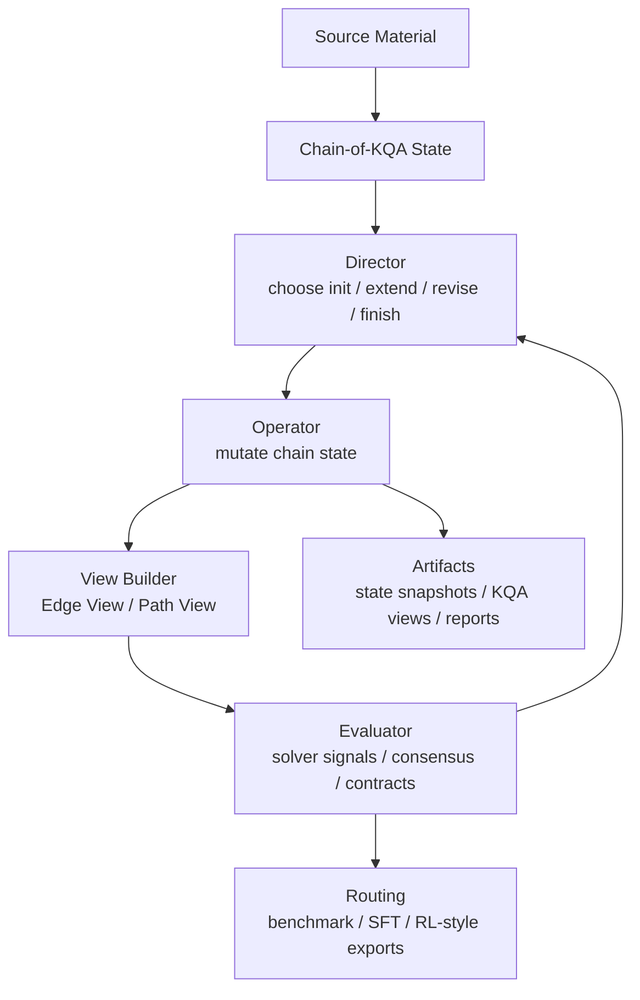

# Implementation Preview: Prompt Contracts and State Interfaces

这组预览展示 AgenQA 中的 prompt contracts 与 state interfaces。核心工程思路是：把 LLM generation 约束成 typed state-transition system。每个 operator 读取显式 chain state，执行有边界的 state mutation，维护 invariants，输出可回放 artifacts，并接受 solver feedback 评估。

## Architecture Overview

## Engineering Layers

| Layer | What it controls | Why it matters |
| --- | --- | --- |
| State layer | Chain-of-KQA state, premise bank, fact bank, dependency spine | makes generation persistent and inspectable |
| Control layer | Director decision over `init / extend / revise / finish` | turns open-ended agent behavior into a bounded controller |
| Mutation layer | Extend / Revise operators | makes each generation step a typed state edit |
| View layer | Edge View and Path View projections | separates correctness control from difficulty amplification |
| Evaluation layer | solvers, consensus, answer/world contracts | closes the loop with online accept/repair signals |
| Artifact layer | replayable JSON reports and snapshots | makes failures debuggable and runs auditable |

## Preview Map

| Preview | What it shows | Engineering signal |
| --- | --- | --- |
| [Director Decision Contract](./director_decision_contract.md) | how the controller chooses the next operation from state and feedback | state-machine orchestration |
| [Extend Operator Pipeline](./extend_operator_pipeline.md) | how a new KQA transition is appended | typed state mutation |
| [Dependency Certificate Schema](./dependency_certificate_schema.md) | how a step records what it used and produced | verifiability and auditability |
| [Path-Fold Visibility Contract](./path_fold_visibility_contract.md) | how one chain becomes Edge/Path solver views | benchmark validity through visibility design |

## Design Takeaway

AgenQA is not a collection of long prompts. The prompts are wrapped as contracts around explicit interfaces: inputs, outputs, invariants, failure handling, and artifacts. This is what lets the system scale from single QA generation to multi-step benchmark construction.
