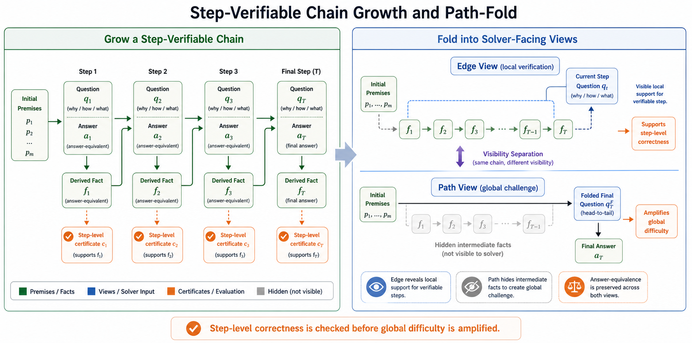
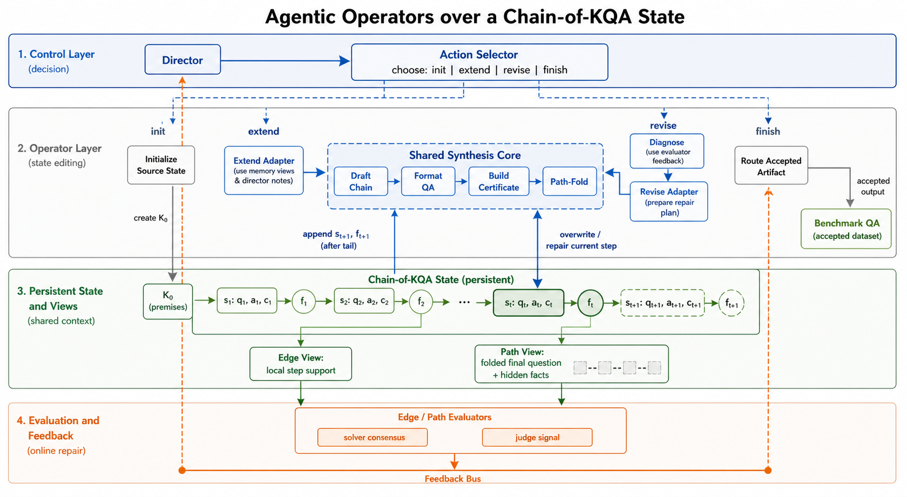

# 系统架构

[English](./architecture.md)

## 核心思想

AgenQA 是一个用于 challenging reasoning QA 的 synthesis harness。它的核心对象不是单个生成问题，而是一条 **Chain-of-KQA**：每一步都绑定已知上下文、问题、答案等价事实和依赖证书。

系统从同一条 chain 构造两个视角：

- **Edge View**：暴露单步依赖转移所需的局部支撑，用于验证 step-level correctness。
- **Path View**：通过 Path-Fold 隐藏中间事实，让 solver 端到端重构依赖路径。

这样，AgenQA 将 synthetic QA generation 中常常纠缠在一起的两个目标分开：局部正确性控制与全局难度放大。

## System Loop

整个合成过程是一个受控状态转移循环：

```text
当前 Chain-of-KQA State
        |
        v
Director: 选择 init / extend / revise / finish
        |
        v
Operator: 修改 chain state
        |
        v
构造 Edge / Path views
        |
        v
Evaluator: solvers + consensus + judge signals
        |
        v
反馈给 Director 和 revision planning
```

## Director

Director 是控制层。它不直接写最终题目，而是读取当前链的进度、历史、可选操作、solver outcomes、ambiguity signals、contract reports 和 repair history，然后决定初始化、扩展、修复或终止。

## Operators

Operators 是作用在 Chain-of-KQA object 上的 state editors。

| Operator | 作用 | State edit |
| --- | --- | --- |
| `init` | 初始化 source-grounded state | 创建起始上下文 |
| `extend` | 增加新的依赖步骤 | 追加 KQA transition |
| `revise` | 修复有问题的步骤 | 覆盖或修复当前 transition |
| `finish` | 路由 accepted chain | 导出 benchmark-facing artifacts |

Extension 和 revision 复用同一个 synthesis core：先草拟候选步骤，再整理成 QA 形式，构造 dependency certificate，最后执行 Path-Fold。二者的区别在于 adapter logic 和 state-edit semantics。

## Evaluator

Evaluator 使用 solver responses、multi-solver consensus 和 judge signals 检查 Edge / Path views。反馈会写回在线状态，使后续 Director decision 能够基于上下文继续扩展、修复或停止。

因此，AgenQA 不是一个生成后再过滤的 pipeline；verification 是 generation process 的一部分。

## 为什么这个架构可扩展

这个 harness 的可扩展性来自稳定的控制接口：

- 更长的 chain 仍然使用同一套 append / repair / evaluate / route 生命周期；
- 不同领域可以替换 source grounding、operator adapters、view constructors 或 solver ensembles；
- benchmark、SFT 和 RL-style exports 可以从同一批 accepted Chain-of-KQA snapshots 路由出来。




